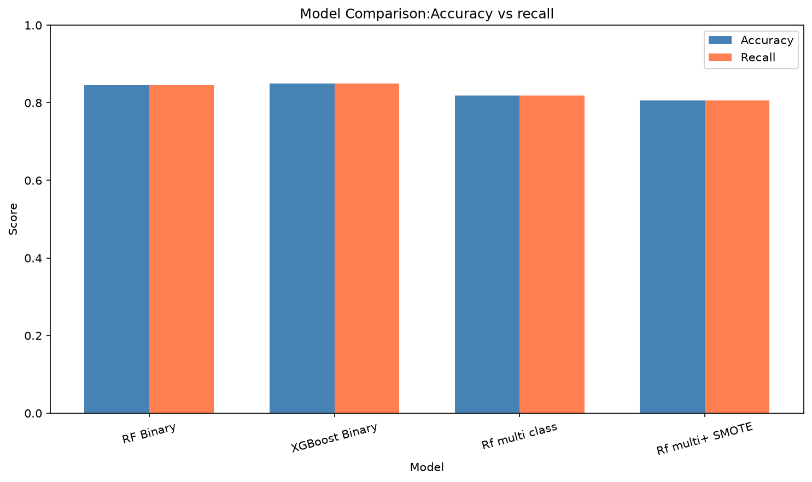
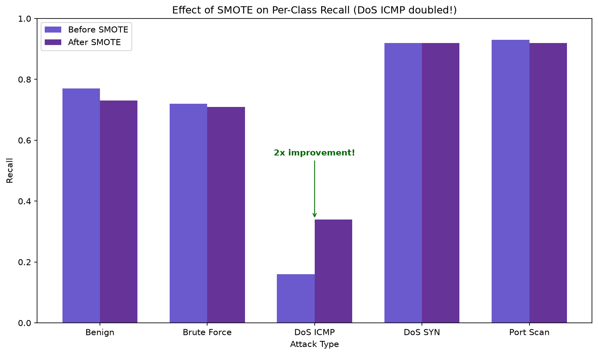
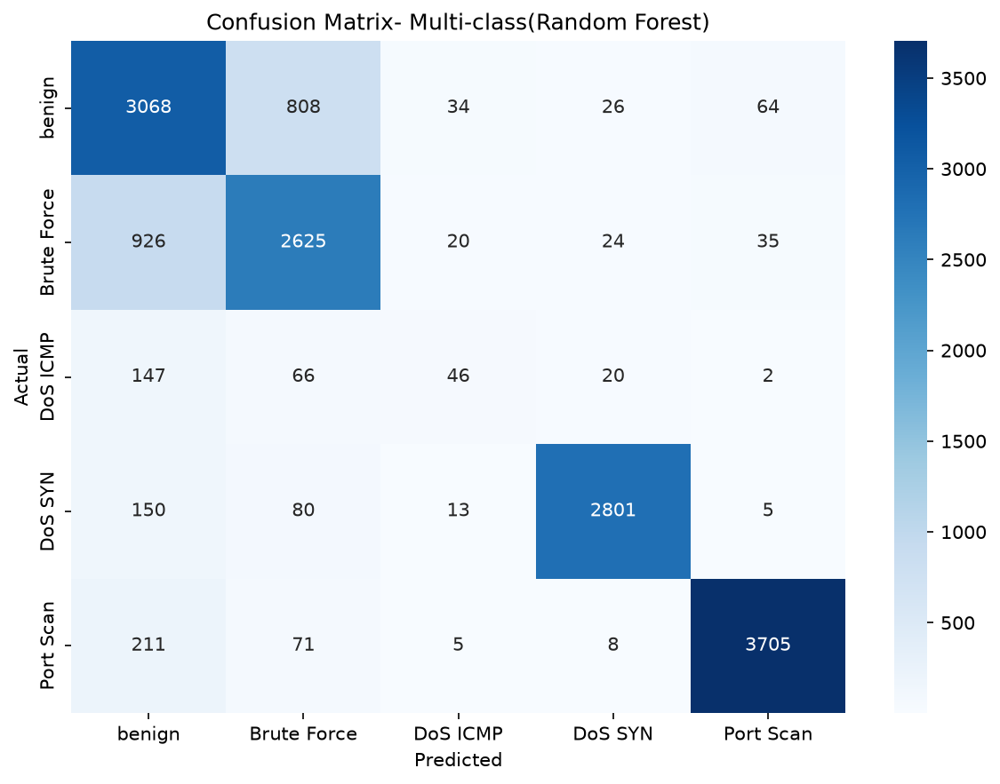

# Network Intrusion Detection System (NIDS) using Machine Learning

A machine learning project that detects network intrusions in IoT traffic, with a focus on a problem most intrusion-detection projects quietly ignore: **rare attacks slip through, and high accuracy hides it.**

This project trains models to classify network traffic into normal and multiple attack types, then demonstrates how class imbalance causes a rare attack (DoS ICMP Flood) to go undetected — and how SMOTE recovers it, at a measurable trade-off.

---

## The Core Finding (TL;DR)

A Random Forest reached ~82% accuracy on multi-class detection. That number looks fine — but it hides a failure:

- **DoS ICMP Flood** had only ~1,400 samples vs ~20,000 for other classes.
- Without balancing, the model caught only **16%** of DoS ICMP attacks (recall = 0.16). It was labelling most of them as *benign* — the worst possible mistake in security.
- After applying **SMOTE**, DoS ICMP recall **doubled to 0.34**, at the cost of a small drop in overall accuracy (82% → 81%) and precision.

**Takeaway:** in imbalanced security data, accuracy alone is misleading. The "best" model depends on what you value — and missing a real attack usually costs more than a false alarm.

---

## Dataset

**CIC-BCCC-NRC-TabularIoTAttack-2024** (CIC-BCCC-NRC-ACI-IOT-2023 subset) — a modern (2024) tabular IoT attack dataset built from CICFlowMeter network-flow features.

Five traffic types were used:

| Type | Label | Samples (sampled) |
|---|---|---|
| Benign Traffic | normal | ~20,000 |
| Recon Port Scan | attack | ~20,000 |
| Dictionary Brute Force | attack | ~18,000 |
| DoS SYN Flood | attack | ~15,000 |
| DoS ICMP Flood | attack | **~1,400 (rare)** |

Each row is a network flow with 80+ features (duration, packet counts, byte rates, TCP flags, etc.).

---

## Method

1. **Load & combine** the five CSV files into one table (~75,000 rows).
2. **Clean:** drop identifier columns (IP, ports, timestamp, flow ID) so the model learns *behaviour*, not addresses. Checked for NaN / infinity values (none present).
3. **Label:** build both a binary target (normal vs attack) and a multi-class target (per attack type).
4. **Split:** stratified 80/20 train/test.
5. **Train:** Random Forest and XGBoost; then Random Forest with **SMOTE** to address class imbalance.
6. **Evaluate:** accuracy, per-class precision/recall/F1, confusion matrix — with emphasis on per-class recall.

---

## Results

### Model comparison

| Model | Task | Accuracy | Recall (weighted) |
|---|---|---|---|
| Random Forest | Binary | 0.845 | 0.845 |
| XGBoost | Binary | 0.850 | 0.850 |
| Random Forest | Multi-class | 0.819 | 0.819 |
| Random Forest + SMOTE | Multi-class | 0.806 | 0.806 |



> Binary tasks score higher because the problem is easier (2 classes vs 5). Comparing models across different tasks on accuracy alone is misleading — which is the whole point.

### The SMOTE effect (the main finding)

Per-class recall, before vs after SMOTE:

| Class | Before | After | Change |
|---|---|---|---|
| Benign | 0.77 | 0.73 | ↓ |
| Brute Force | 0.72 | 0.71 | ↓ |
| **DoS ICMP** | **0.16** | **0.34** | **↑ 2x** |
| DoS SYN | 0.92 | 0.92 | = |
| Port Scan | 0.93 | 0.92 | ↓ |



### Confusion matrix (multi-class Random Forest)



The diagonal shows correct predictions. Note the DoS ICMP row: most real DoS ICMP attacks are misclassified as *benign* — a concrete picture of the rare-class failure.

---

## Project Structure

```
nids-project/
├── data/raw/              # raw CSV files (not committed)
├── notebooks/
│   └── 01_exploration.ipynb   # exploration, experiments, graphs
├── src/nids/
│   ├── config.py          # paths & settings
│   ├── data.py            # load & combine files
│   ├── features.py        # cleaning & target creation
│   ├── train.py           # Random Forest, XGBoost, SMOTE
│   └── evaluate.py        # metrics & SMOTE comparison
├── scripts/
│   └── run_pipeline.py    # run the whole pipeline in one command
├── results/               # saved graphs
├── requirements.txt
└── README.md
```

---

## How to Run

```bash
# 1. Set up environment
python -m venv venv
venv\Scripts\activate        # Windows
pip install -r requirements.txt

# 2. Place the dataset CSVs in data/raw/
#    (benign.csv, dos_icmp.csv, dos_syn.csv, brute_force.csv, port_scan.csv)

# 3. Run the full pipeline
python scripts/run_pipeline.py
```

The pipeline loads the data, trains a Random Forest with and without SMOTE, and prints a per-class recall comparison showing the DoS ICMP improvement.

---

## What I Learned

- **Accuracy lies on imbalanced data.** A high overall score can hide a completely undetected attack class.
- **Per-class recall is the metric that matters** for rare, high-stakes events.
- **SMOTE is a trade-off, not a free win** — it recovered the rare class but slightly hurt overall accuracy and precision. Choosing whether that trade is worth it is a judgement call, not a number.
- **Tree models don't need feature scaling** — confirmed empirically (scaling left Random Forest results essentially unchanged).

---

## Tech Stack

Python · pandas · scikit-learn · XGBoost · imbalanced-learn (SMOTE) · matplotlib · seaborn

---

## Possible Next Steps

- Add SHAP explanations to interpret individual predictions.
- Test generalisation by training on one IoT dataset and testing on another.
- Extend to a second threat type (e.g. ransomware) for a cross-domain comparison.
